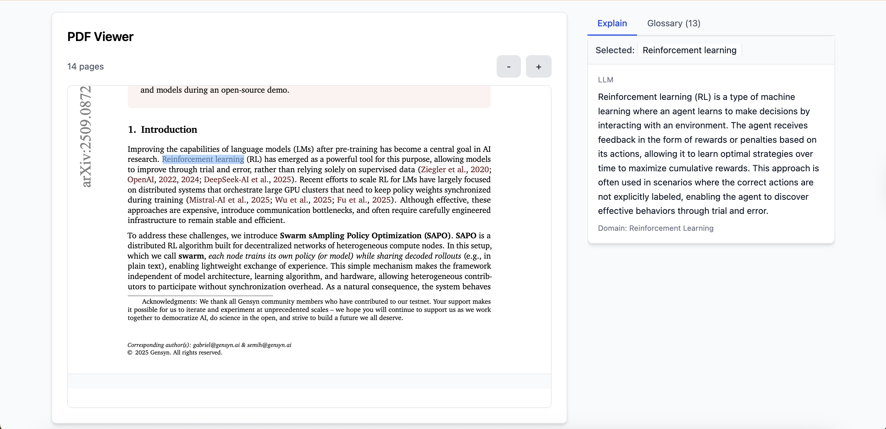

# Glossify



An interactive reading assistant that turns academic PDFs into easy-to-understand content. Upload a paper, highlight text, and get clear, context-aware explanations with an auto-generated glossary — all in one clean interface.

## Quick Start

- Prerequisites: Python 3.8+, Node.js 18+, an OpenAI API key

1) Clone
```
git clone <repository-url>
cd Glossify
```

2) Backend
```
cd backend
pip install -r requirements.txt
echo "OPENAI_API_KEY=your_openai_api_key_here" > .env
python app/main.py
```
Backend runs at http://localhost:5001

3) Frontend
```
cd frontend
npm install
cp env.local.example .env.local  # optional; update API URL if needed
npm run dev
```
Frontend runs at http://localhost:3000

4) Use It
- Open http://localhost:3000
- Upload a PDF, then highlight text to see explanations
- Browse the Glossary tab to view defined terms

—

Note: Place your screenshot at `docs/screenshot.png` (or update the path above).
